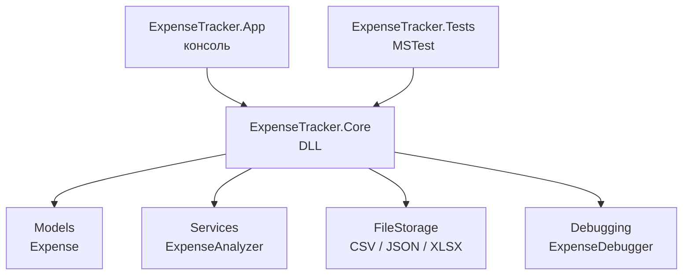

# Карта требований экзамена

Здесь показано, какой файл закрывает какой пункт задания.

## 1. Разбиение проекта на модули

Модули лежат в DLL-проекте `src/ExpenseTracker.Core`:

- `Models/Expense.cs` - модель данных.
- `Services/ExpenseAnalyzer.cs` - расчеты.
- `FileStorage/*.cs` - чтение и запись файлов.
- `Debugging/*.cs` - отладочные классы.
- `DemoData/SampleExpenses.cs` - демонстрационные данные.

## 2. Чтение и запись файлов

- CSV: `FileStorage/CsvExpenseStorage.cs`.
- JSON: `FileStorage/JsonExpenseStorage.cs`.
- XLSX: `FileStorage/ExcelExpenseStorage.cs`.

Все три класса имеют методы:

```csharp
Save(path, expenses);
Load(path);
```

## 3. Git

В проекте есть локальный Git-репозиторий.

Что нужно уметь показать:

```powershell
git status
git log --oneline --decorate --graph --all
git branch
git remote -v
```

Практика лежит в [GitPractice.md](GitPractice.md).

## 4. Отладочные классы

Файлы:

- `Debugging/IDebugLogger.cs`
- `Debugging/ConsoleDebugLogger.cs`
- `Debugging/ExpenseDebugger.cs`

`ExpenseDebugger` выводит расходы только в Debug-сборке:

```csharp
#if DEBUG
    ...
#endif
```

## 5. Модульное тестирование

Тесты лежат в `tests/ExpenseTracker.Tests`:

- `ExpenseAnalyzerTests.cs` - тестирует расчеты.
- `FileStorageTests.cs` - тестирует CSV, JSON, XLSX.
- `ExpenseDebuggerTests.cs` - тестирует отладочный класс.

Запуск:

```powershell
dotnet test .\ExpenseExamTraining.sln
```

## 6. Комментирование кода

В коде есть два типа комментариев:

- `/// <summary>` - описание классов, моделей и интерфейсов.
- `//` - пояснение важных шагов внутри методов.

Важно: хороший комментарий объясняет смысл, а не пересказывает очевидную строку.

## 7. DLL-проект и консольный проект

DLL:

```text
src/ExpenseTracker.Core
```

Консоль:

```text
src/ExpenseTracker.App
```

Консоль подключает DLL через `ProjectReference`:

```xml
<ProjectReference Include="..\ExpenseTracker.Core\ExpenseTracker.Core.csproj" />
```

## Общая схема


