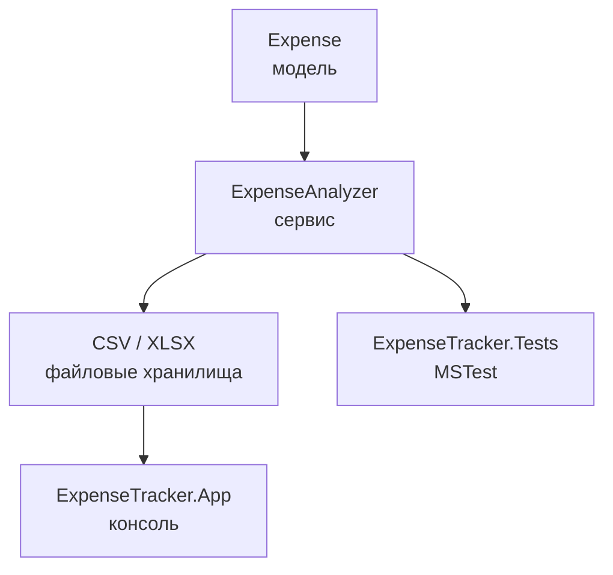

# Карта требований экзамена

## 1. Разбиение проекта на модули

Проект состоит из трех проектов:

- `ExpenseTracker.Core` - DLL с основной логикой.
- `ExpenseTracker.App` - консольное приложение.
- `ExpenseTracker.Tests` - MSTest-тесты.

Внутри DLL логика разбита по папкам:

- `Models` - модель `Expense`.
- `Services` - `ExpenseAnalyzer` и `ExpenseSummary`.
- `FileStorage` - CSV/XLSX-хранилища.
- `Diagnostics` - отладочный класс `DebugHelper`.

## 2. Чтение и запись файлов

Используются только два формата:

- CSV: `CsvExpenseStorage.cs`.
- XLSX: `ExcelExpenseStorage.cs`.

## 3. Git

Структура проекта удобна для Git:

- исходники лежат в `src`;
- тесты лежат в `tests`;
- документация лежит в `docs`;
- временные файлы `bin`, `obj`, `TestResults` исключены через `.gitignore`.

Полезные команды:

```powershell
git status
git branch
git log --oneline --decorate --graph --all
git remote -v
```

## 4. Отладочные классы

Отладка находится в:

```text
src/ExpenseTracker.Core/Diagnostics/DebugHelper.cs
```

`DebugHelper` использует:

```csharp
System.Diagnostics.Debug.WriteLine(...)
System.Diagnostics.Trace.WriteLine(...)
```

Класс используется в:

- `ExpenseAnalyzer`;
- `CsvExpenseStorage`;
- `ExcelExpenseStorage`.

## 5. Модульное тестирование

Тесты лежат в:

```text
tests/ExpenseTracker.Tests
```

Файлы:

- `ExpenseAnalyzerTests.cs`;
- `FileStorageTests.cs`.

## 6. Комментирование кода

Основные публичные классы и методы имеют краткие XML-комментарии `/// <summary>`.

## 7. DLL и консоль

`ExpenseTracker.Core` - это DLL-проект.

`ExpenseTracker.App` подключает DLL через `ProjectReference` и вызывает готовые классы. Основной бизнес-логики в `Program.cs` нет.

## Схема


