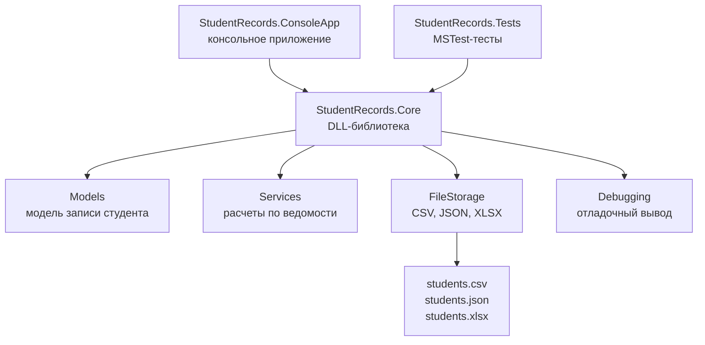

# Гид по проекту

Этот файл можно читать как мини-конспект к защите. Он объясняет, что происходит в проекте и зачем нужны отдельные папки.

## Общая схема



## Что запускается первым

Точка входа находится в файле `src/StudentRecords.ConsoleApp/Program.cs`.

Программа делает простые шаги:

1. Создает папку `data` рядом с exe-файлом.
2. Берет демонстрационные данные из `SampleStudents`.
3. Передает записи в CSV-, JSON- и XLSX-хранилища.
4. Читает эти файлы обратно.
5. Строит сводку: средний балл, сколько студентов сдали, сколько не сдали, лучший результат.

## Где находится DLL

Проект `src/StudentRecords.Core` собирается в DLL.

Именно там лежит основная логика:

- `Models/StudentRecord.cs` - одна запись ведомости.
- `Services/GradeAnalyzer.cs` - расчеты.
- `FileStorage/CsvStudentStorage.cs` - работа с `.csv`.
- `FileStorage/JsonStudentStorage.cs` - работа с `.json`.
- `FileStorage/ExcelStudentStorage.cs` - работа с `.xlsx`.
- `Debugging/StudentRecordsDebugger.cs` - отладочный вывод.

Консольный проект подключает DLL через `ProjectReference` в `.csproj`.

## Почему файловые классы разделены

У всех файловых классов есть общий интерфейс `IStudentFileStorage`.

Это значит, что консольному приложению почти все равно, с каким форматом оно работает:

```csharp
storage.Save(path, records);
var loaded = storage.Load(path);
```

Такой подход удобен на экзамене: можно показать, что проект разбит на модули, а не написан одним большим куском.

## Где тесты

Тесты лежат в `tests/StudentRecords.Tests`.

Они проверяют:

1. Расчет среднего балла и количества сдавших.
2. Обработку неправильного балла.
3. Сохранение и чтение CSV.
4. Сохранение и чтение JSON.
5. Сохранение и чтение XLSX.
6. Работу отладочного класса.

Запуск:

```powershell
dotnet test .\ModularExamDemo.sln
```

## Где комментарии

В коде добавлены комментарии двух типов:

- `/// <summary>` над классами и важными свойствами - это описание назначения.
- Обычные `//` внутри методов - это короткие пояснения к неочевидным шагам.

Комментарии не пересказывают каждую строку, а объясняют, зачем нужен блок кода.
